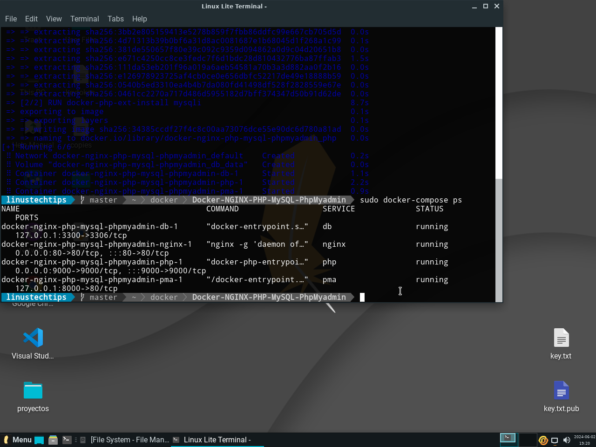
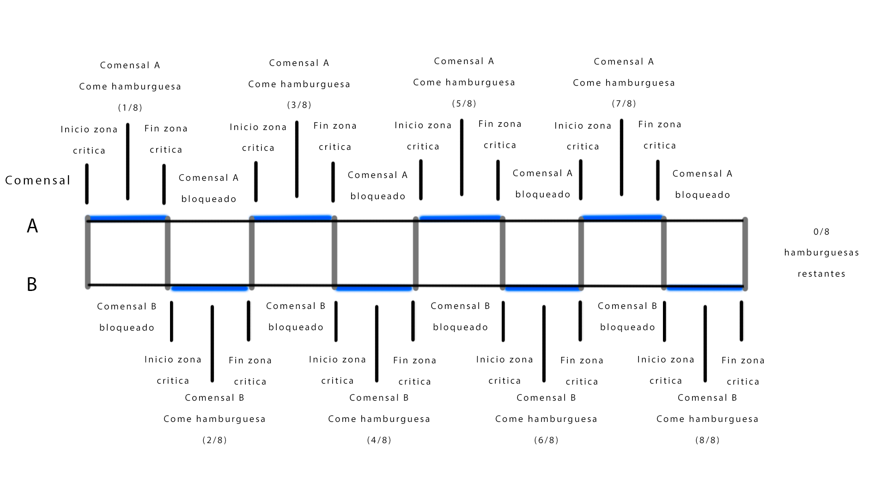

#Practico 4

# Práctico 3
1) 
a) En mi caso, es predecible hasta cierto punto. El con hilos rondaba 4,05 segundos en ejecutarse, y el sin hilos 5,9 segundos aproximadamente.
b) Similares. +- 0,1 segundos.
c) Se incrementa drasticamente el tiempo de ejecucion ya que está haciendo dos cuentas de 0 a 999, gastando tiempo de procesado inutilmente.

2)
a) <a href = "./TP3/con_race_condition.c" >codigo resuelto</a>                 // no se si funcione asi jeje, esta en la carpeta tp3
b) 
