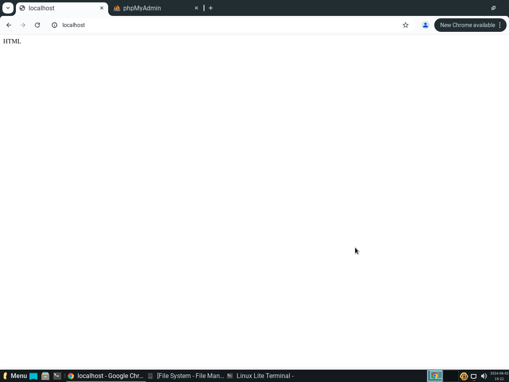

#Practico 4

# Práctico 3
1) 
a) En mi caso, es predecible hasta cierto punto. El con hilos rondaba 4,05 segundos en ejecutarse, y el sin hilos 5,9 segundos aproximadamente.
b) Similares. +- 0,1 segundos.
c) 
Al ejecutar el codigo con las lineas descomentadas, noté que el programa tardaba más en completarse. Esto se debió a que descomenté dos bucles adicionales dentro de las funciones sumador y restador, que se ejecutaban mil veces cada uno. Aunque cada iteración no hacía nada útil, incrementaba el tiempo total de ejecución.

En resumen, el tiempo de ejecución aumentó debido a estas iteraciones adicionales. Además, el valor final cambió porque, al agregar estos bucles, el acumulador se modificaba durante mil iteraciones más en cada función, afectando el resultado final del programa

2)
a) <a href = "./TP3/con_race_condition.c" >codigo resuelto</a>   
b) 
